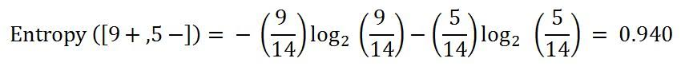

<section id="themes">
	<h2>Themes</h2>
		

			Set your presentation theme:  
			<!-- Hacks to swap themes after the page has loaded. Not flexible and only intended for the reveal.js demo deck. -->
			<a href="#" onclick="document.getElementById('theme').setAttribute('href','css/theme/black.css'); return false;">Black (default)</a> -
			<a href="#" onclick="document.getElementById('theme').setAttribute('href','css/theme/white.css'); return false;">White</a> -
			<a href="#" onclick="document.getElementById('theme').setAttribute('href','css/theme/league.css'); return false;">League</a> -
			<a href="#" onclick="document.getElementById('theme').setAttribute('href','css/theme/sky.css'); return false;">Sky</a> -
			<a href="#" onclick="document.getElementById('theme').setAttribute('href','css/theme/beige.css'); return false;">Beige</a> -
			<a href="#" onclick="document.getElementById('theme').setAttribute('href','css/theme/simple.css'); return false;">Simple</a>  
			<a href="#" onclick="document.getElementById('theme').setAttribute('href','css/theme/serif.css'); return false;">Serif</a> -
			<a href="#" onclick="document.getElementById('theme').setAttribute('href','css/theme/night.css'); return false;">Night</a> -
			<a href="#" onclick="document.getElementById('theme').setAttribute('href','css/theme/moon.css'); return false;">Moon</a> -
			<a href="#" onclick="document.getElementById('theme').setAttribute('href','css/theme/solarized.css'); return false;">Solarized</a>
		

</section>

H:
# ID3 Algorithm
(Iterative Dichotomiser 3)

By  [Sebastian Chaves](https://github.com/adamantwharf) - [Daniel Castañeda]() - [Jimmy Pulido](https://github.com/jiapulidoar) - [Miller Cubillos]() 

H:
<!-- .slide: data-background="#ffffff" --> 
# PRESENTATION URL
[http://futureun.github.io/ID3/#](http://futureun.github.io/ID3/#)
H:

# Index
<!-- .slide: data-background="#7E2121" --> 
 1. Basic Theorems of Probability<!-- .element: class="fragment" data-fragment-index="0"-->
 1. Bayes' Theorem. <!-- .element: class="fragment" data-fragment-index="1"-->
 1. Entropy <!-- .element: class="fragment" data-fragment-index="2"-->
 1. Decision Tree.  <!-- .element: class="fragment" data-fragment-index="3"-->
 1. ID3 Algorithm. <!-- .element: class="fragment" data-fragment-index="4"-->
	

H:
<!-- .slide: data-background="#005050" -->
#Basic Theorems

V:
##Axiomatic definition of probability

Let (Ω, F, P) be a measure space with P(Ω)=1. Then (Ω, F, P) is a probability space, with sample space Ω, event space F and probability measure P.

P set function defined on A with values in [0, 1]

>P : A −→ R 

V:
 Must satisfy the following three axioms:

* The probability of an event is a non-negative real number:
		P(A) ≥ 0, ∀A ∈ A

* The probability  in the entire sample space  is 1.

		P(Ω) = 1

* This is the assumption of σ-additivity:
 
		Ai ∩ Aj = ∅ ∀i ≠ j, 
		
</img>

V:
###Consequences:

* P(ø) = 0 
* If AЄΩ & Ac is the complement of A:
		P(Ac)= 1-P(A)
* If A, B Є Ω it may happen that: 
      A & B & are exclusive; in this case: 
            P(AUB)=P(A)+P(B) 
      A & B Є Ω & are NOT exclusive: 
            P(A∪B)=P(A)+P(B)-P(A∩B) 

V:

* If A, B & C Є Ω & are independients also:  
      P(A∩B∩C)=P(A)*P(B)*P(C)  
* If A, B & C Є Ω & are dependient events: 
      P(A∩B∩C)=P(A)*P(B⁄A)*P(C⁄(A∩B)) 
* If A, B Є Ω & are coditioned events:

  The probability of A given that B happened is: 
      P(A⁄B)=(P(A∩B))/(P(B)) ; 
      
  The probability of B given that A happened is: 
       P(B⁄A)=(P(A∩B))/(P(A)); 

H:
# Bayes' Theorem
<!-- .slide: data-background="#005050" -->

V:
##Statement of Theorem 
Bayes' theorem is stated mathematically as the following equation:

</img>
>where A and B are events.

H:
# Decision Tree 
<!-- .slide: data-background="#7E2121"  -->
V:
##Structure
* __Nodes__: Names or identifiers of the attributes
* __Branches__: Possible values associated to the node attribute.
* __Leaves__: Sets of examples already classified and labeled with the name of a class.

V:
##Data

* __Attributes__: Are the factors that influence the classification or decision.
* __Class__: Possible values of solution.
* __Examples__: Are the set of combinations of given attributes.

V:
You can choose between 2 business projects: a candy shop or a lemonade stand.

</img>

Which will you choose? 
Surely the candy shop.

V:
Given the percents of failure and success of each project:

</img>

Now, which will you choose?

V:
Calculating the expeted values, it's easy make a good choice

</img>

V:
Another simple example

</img>

H:
#Entropy and Gain

V:

##Entropy
A measure of the uncertainty that exists in a system. That is, in a given situation, the probability of occurring each of the possible outcomes.

</img>

V:
##Interpretation

An example of the binary entropy could get a ball of white or black from a bag.

• If the bag there are 3 white balls and 3 black the result is completely unknown, that is to say uncertainty is high, ie entropy is 1.

</img>

V:

• If the bag is 6 black balls the result is known in advance, then there is no uncertainty, and entropy is 0.
 </img>
V:
##Gain
>is the difference between the entropy of a node and one of its descendants.

</img>

V:
##Entropy and Baye's Theorem

</img>

H: 
<!-- .slide: data-background="#005050" -->
#Iterative Dichomiser 3 (ID3) Algorithm
V:
## ID3

Algorith invented by Ross Quinlan (1983), used in the machine learning and 
natural language procesing to generate a decision tree from dataset.

V:

Issues that faces this kind of algorithms:

* Choosing spliting attributes

* Orderin of splitting attributes

* Number of splits to take

* Balance of tree structure

* Stopping criteria
V:

> Its objective is to determine the best classification attribute form condition
attribute sets.

>The algorithm chooses information gain as attribute of current node, in order
to make information entropy that divided subsets need smallest.

V:

##Entropy

Given probabilities p1, p2, …, ps , where ∑pi = 1, Entropy is defined as:

</img>

V:
>H(p1, p2, …, ps) = ∑ - (pi log pi)

Entropy finds the amount of order in a given database state. A value of H = 0 identifies a 
perfectly classified set. In other words, the higher the entropy, the higher the potential to 
improve the classification process.

V:
## Information Gain

ID3 chooses the splitting attribute with the highest gain in information, 
where gain is defined as difference between how much information is 
needed after the split.

V:

This is calculated by determining the differences
between the entropies of the original dataset and the weighted sum of 
the entropies from each of the subdivided datasets. The formula used 
for this purpose is

</img>

 V: 
##Example 
ID3 examines all the attributes and choose the maximum gain, forms the
branch and uses the same process recursively to form sub-trees from the n generated nodes. 

</img>

V:

</img>
</img>
V:
</img>

H: 
<!-- .slide: data-background="#005050" -->
#Predecting student’s performance using the ID3 algorithm
V:
## Description

Provide a good perspective of the probable results of students admited in Fr. C. Rodrigues Institute of Technology, based on past performance.

V:
## Sample Space	

Enrolled students of the first year of engineering. Data given for each student:

* Full Name
* Gender
* Application ID
* Scores in board examinations of classes X and XII
* Scores in entrance examinations
* Category and admission type

V:
## Manage the data
 
* Data mining
* Classification 
* Clustering

V: 
## Implementation
1. Information about old students was collected
1. Extraneous information was removed.
1. Applying the ID3 algorithm to obtain decision tree
1. The test data was applied to the decision trees
1. Developing the front end in the form of a web application

V:
## Data

</img>

V:

## Selecting the classes

* The __merit__ attribute had a value:
        good if the score >=  120 
        bad if the  score < 120
* The __percentage__ of marks scored by the student in the subjects of Physics, Chemistry and Mathematics :
        “distinction” : score >= 70
        “first_class” : score < 70 & >= 60
        “second_class” : score < 60
* Admission __type__
        AI ( all-indian seats) 
        Other

V:
## The Result Tree

</img>

V:
## Test the tree

They built a platafform where the user upload the information, then using the decision tree pedict if the student will pass or not.

>The accuracy of the information was  75.145% 

H:
<!-- .slide: data-background="#005050" -->
#Conclusion

V:

* The decision tree generated by the Algorithm has a good approach to predict future events based on the past. Through the use of entropy and gain, and in the case of the algorithm, the main base, Bayes' theorem.

 

H:
<!-- .slide: data-background="#005050" -->
#References

V: 
* [PREDICTING STUDENTS’ PERFORMANCE USING ID3 AND C4.5 CLASSIFICATION ALGORITHMS](http://arxiv.org/pdf/1310.2071.pdf)
* [An Implementation of ID3 ](http://web.arch.usyd.edu.au/~wpeng/DecisionTree2.pdf)
* [The ID3 Algorithm ](http://www.cise.ufl.edu/~ddd/cap6635/Fall-97/Short-papers/2.htm)

